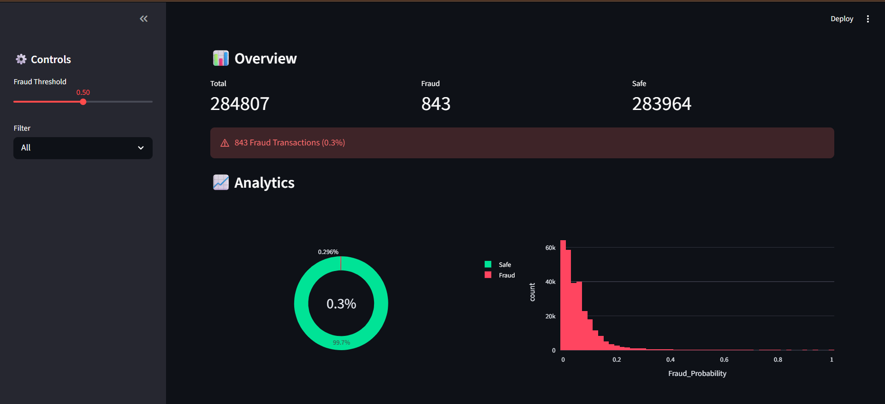
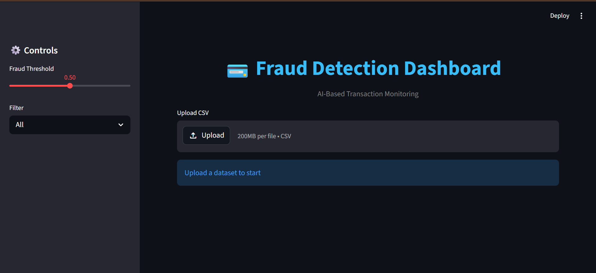
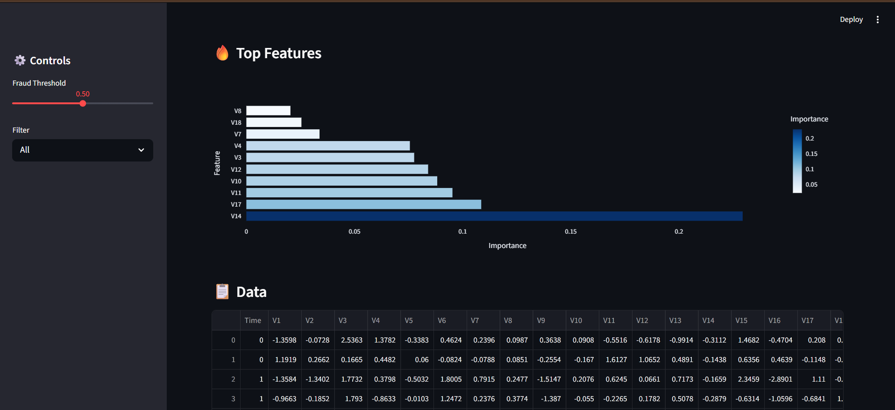
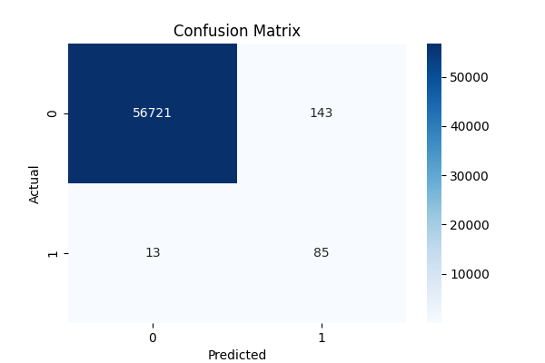

# 💳 Credit Card Fraud Detection Dashboard

## 🚀 Overview

An end-to-end Machine Learning project for detecting fraudulent credit card transactions, built with a complete pipeline—from data preprocessing and imbalance handling to model training and an interactive dashboard.

The system predicts fraud probability for each transaction and provides a visual dashboard for analysis and monitoring.

---

## 🎯 Problem Statement

Credit card fraud is rare but highly impactful. The dataset is extremely imbalanced (~0.17% fraud), making detection challenging. Traditional accuracy is not sufficient; the focus must be on detecting fraud effectively (high recall).

---

## 🧠 Solution Approach

* Data preprocessing and feature scaling
* Handling class imbalance using **SMOTE**
* Training a **Random Forest Classifier**
* Generating fraud probability scores
* Building an interactive dashboard using **Streamlit**
* Visualizing insights with **Plotly**

---

## ⚙️ Tech Stack

* **Python**
* **Pandas, NumPy**
* **Scikit-learn**
* **Imbalanced-learn (SMOTE)**
* **Plotly**
* **Streamlit**

---

## 📊 Dashboard Features

* Upload transaction dataset
* Real-time fraud prediction
* Adjustable fraud detection threshold
* Fraud probability visualization
* Donut chart (fraud vs safe)
* Feature importance analysis
* Interactive filtering (Fraud / Safe)
* Clean and responsive UI

---

## 📸 Dashboard Preview

### 🔹 Overview



### 🔹 Upload Interface



### 🔹 Feature Analysis & Data



---

## 📈 Model Details

* Model: **Random Forest Classifier**
* Imbalance Handling: **SMOTE**
* Evaluation Metrics:

  * Precision
  * Recall
  * F1 Score

---

## 📊 Model Outputs

### 🔹 Confusion Matrix



### 🔹 Classification Report

See: `outputs/classification_report.txt`

---

## ⚠️ Key Challenge: Imbalanced Data

* Fraud transactions are extremely rare (~0.17%)
* Model can ignore fraud if not handled properly

### Solution:

* Applied SMOTE to balance training data
* Focused on **Recall over Accuracy**
* Added **threshold tuning** in dashboard for flexibility

---

## 📂 Project Structure

```
Credit-Card-Fraud-Detection/
│
├── data/
├── images/
├── models/
├── outputs/
├── src/
├── app.py
├── requirements.txt
└── README.md
```

---

## ▶️ How to Run

### 1. Clone Repository

```bash
git clone https://github.com/Varda24/credit-card-fraud-detection-dashboard.git
cd credit-card-fraud-detection-dashboard
```

### 2. Create Virtual Environment

```bash
python -m venv venv
venv\Scripts\activate   # Windows
```

### 3. Install Dependencies

```bash
pip install -r requirements.txt
```

### 4. Run Dashboard

```bash
streamlit run app.py
```

---

## 💡 Key Learnings

* Handling imbalanced datasets in real-world problems
* Building end-to-end ML pipelines
* Model evaluation beyond accuracy
* Designing interactive dashboards for ML applications
* Feature importance interpretation

---

## 🚀 Future Improvements

* Deploy as a live web application
* Add real-time transaction simulation
* Use deep learning (Autoencoders / LSTM)
* Integrate with payment systems API

---

## 📬 Contact

Feel free to connect for collaboration or discussion.
